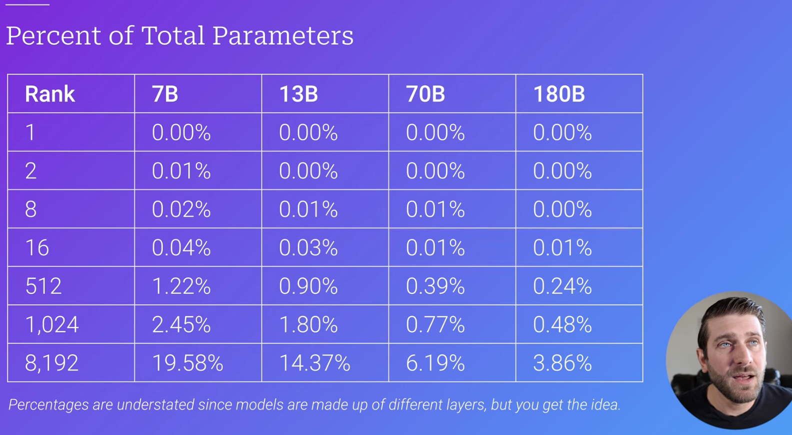

# NLP&LLM Knowledge Base

Sources:

https://zhuanlan.zhihu.com/p/643560888

https://mp.weixin.qq.com/s/mTJGp86qgifRjyvr79_lYA

https://mp.weixin.qq.com/s/9J4fM4A9jJv4UwJmqsLB6g

https://mp.weixin.qq.com/s/eF_isJKd5B2h2edpC3nhfg

## Attention & Transformer

### Basics

- Self Attention:

$$
Softmax(\frac{QK^T}{\sqrt d})V
$$

- Why Scaling by $\sqrt{d}$:

  - 当x数量级过大时，y=softmax(x)中会给最大值赋予特别大的概率，其他位置几乎为0。这导致$\part y/\part x$很多位置都是0，导致梯度消失. Applying scaling helps normalize the data distribution.

  - 假设q和k是相互独立的随机变量，服从标准正态分布，则qk=$\sum^d_{i=1} q_ik_i$~N(0, d)，所以为了将其标准化，除以$\sqrt d$可使方差变为1.
- Why layernorm instead of batchnorm
  - 如果在一个维度内进行normalization，那么在这个维度内，相对大小有意义的，是可以比较的；但是在normalization后的不同的维度之间，相对大小这是没有意义的
  - BN(batch normalization)广泛应用于CV，针对同一特征，以跨样本的方式开展归一化, 因此不会破坏不同样本同一特征之间的关系
  - Why NLP not applying BN?
    - 对不同样本同一特征的信息进行归一化没有意义：
      - 三个样本（为中华之崛起而读书；我爱中国；母爱最伟大）中，“为”、“我”、“母”归一到同一分布没有意义。
    - 舍弃不了BN中舍弃的其他维度的信息，也就是同一个样本的不同维度的信息：
      - “为”、“我”、“母”归一到同一分布后，第一句话中的“为”和“中”就没有可比性了，何谈同一句子之间的注意力机制？
- Why BERT‘s token embedding，segment embedding，position embedding can be added together?
  - BERT的三个embedding可以直接相加，因为和拼接类似，相加也是对元素的线性组合（同Transformer）
- Computational complexity for self-attention: $O(seq\_len^2)$

- Why multi-head?
  - self-attention can only capture a single perspective in a given input sentence
  - split the Q, K, V matrix on the dimenstion of d_out. Then we get multiple matrix with head_dim = d_out / num_head
  - conduct self-attention for each head. The attention scores remains [seq_length, seq_length]

### Improvements

#### KV-Cache

- Only for inference.

- We only need the context vector (acquired by multi-head attention on all tokens) for the last token in the input sequence to predict the next token.
- During inference, there are a lot of repeated computations
- When a new token comes in, only 3 computes: Input embedding for the new token * Wq, Wk, Wv
- Then we append the new k, v with cached values, and compute with new q to get the new context vector for the new token. -> This is all we need to predict the next token.
- Linear relation between compute time and sequence length
- Disadvantages: takes space
  - Size of KV cache: l * b * n * h * s * 2 * 2
  - l: number of transformer blocks
  - b: batch size
  - n: attention heads
  - h: head dim
  - s: context length
  - 2: K, V
  - 2: floating point

#### MQA

Same key & value matrix for each head. In this way, size of KV cache: l * b * **1** * h * s * 2 * 2

Query matrix are also different across different heads. 

Significant performance degradation

#### GQA

Group the heads into sub-groups, and each group will share the same k v matrix.

#### MLA

Intuition: cache only one matrix instead of k, v matrices. -> We also want this matric has less dimension than n*h. To get this matrix, start by projecting the input embedding matrix into a latent space.

- Query is same as before: Q = X * Wq
- Get **latent matrix** from input embedding: Ckv = X * Wdkv
- Get K/V: K = Ckv * Wuk = X * Wdkv * Wuk, V = Ckv * Wuv = X * Wdkv * Wuv
- Attention scores=$QK^T=XW_q·(W_{uk}^TW_{dkv}X^T)=X(W_qW_{uk}^T)(XW_{dkv})^T$
  - $W_qW_{uk}^T$ is fixed at training
  - $X(W_qW_{uk}^T)$ is called absorbed query - in contrast with traditional just Wq
  - $XW_{dkv}$ needs to be cached

- Output logits: $QK^TVW_o=(QK^T)(XW_{dkv}W_{uv}W_o)$
  - $W_{uv}W_o$ is fixed at training
  - $XW_{dkv}$ needs to be cached

When a new token comes in during inference (1, 8), MLA will

1. Compute the absorbed query vector for the new token: $x(W_qW_{uk}^T)$
2. Compute KV vector
   1. Get the latent embedding for the new token: $xW_{dkv}$
   2. Append to KV cache
3. Multiply absorbed Q with updated KV cache
4. Multiply updated KV cache with Wuv to get values matrix -> context vector for new token

### Positional Encoding

#### Sinusoidal

For binary integer encoding, lower indices change more frequently, suggesting fine-grained encoding. Higher indices change less frequently, meaning coarse encoding. But binary integer encoding are discrete.

We want a continuous encoding that is (1) reflects different position (2) reflects different index of position encoding

Why sin for odd idx and cos for even idx?

- This make the pos encoding at a given i a vector $(\cos\theta, \sin\theta)$ that can be rotated. 
- Then given pos encoding at $\theta$, we can get the pos encoding at $\theta + \theta_1$ by just **rotating** the pos encoding - positions are related to each other

Problem: directly added to token embeddings / change the magnitude -> make the token embeddings augmented with position information, by keeping magnitude same.

#### RoPE

Take query and key vectors, and apply the sin and cos positional encoding to these vectors.

Change the key and value vectors directly

Higher positions -> larger rotations

Lower index -> change fast with position -> capture changes between close words

Higher index -> change slow with position -> capture preservation between distant words

### Links

- visualization: https://www.youtube.com/watch?v=KJtZARuO3JY
- https://www.youtube.com/watch?v=u8pSGp__0Xk&t=14s

## Distributed Training

### Data Parallelism

A batch of training data is splitted into M parts for M GPUs. Model, gradients and optimizer states are replicated among the M GPUs.

和单计算设备训练相比，最主要的区别就在于反向计算中的梯度需要在 所有计算设备中进行同步，以保证每个计算设备上最终得到的是所有进程上梯度的平均值。

**Zero-powered data parallelism** can be applied to further reduce the required replication for each GPU.

- Instead of replicating the full model params, gradients and optimizer states, each GPU stores only a slice of it

### Pipeline Parallelism

将模型的各个层分段处理，并将 每个段分布在不同的计算设备上，使得前后阶段能够流水式、分批进行工作.

- Pipeline Bubble: 计算图中的下游设备(Downstream Device)需要长时 间持续处于空闲状态，等待上游设备(Upstream Device)的计算完成，才能开始计算自身的任务

  

- Gpipe: Split each batch into micro-batch

  

### Tensor Parallelism

In Tensor Parallelism (TP) each GPU processes only a slice of a tensor and only aggregates the full tensor for operations that require the whole thing.

How MLP could be tensor parallelized across two GPUs:

- In the first GeLU, A is splited by columns, resulting Y in column splited
- Y in column splited could be exactly used for the second Dropout, where B is splited by rows
- Z1 and Z2 are all reduced sum to Z

- Special considerations: Due to the two all reduces per layer in both the forward and backward passes, TP requires a very fast interconnect between devices. Therefore it's not advisable to do TP across more than one node, unless you have a very fast network.

## Efficiency

https://blog.eleuther.ai/transformer-math/

### BF16 Optimizer

FP32, FP16, BF16

Training huge LLM models in FP16 is a no-no.

The key to BF16 format is that it has the same exponent as FP32 and thus doesn't suffer from overflow FP16 suffers from a lot! Of course BF16 has bad precision. However, the training using stochastic gradient descent and its variations is a sort of stumbling walk, so if you don't get the perfect direction immediately it's no problem, you will correct yourself in the next steps.

Regardless of whether one uses BF16 or FP16 there is also **a copy of weights which is always in FP32 - this is what gets updated by the optimizer**. So the 16-bit formats are only used for the computation, the optimizer updates the FP32 weights with full precision and then casts them into the 16-bit format for the next iteration.

It's crucial to implement gradient accumulation in FP32 to keep the training precise, and this is what `BF16Optimizer` does.

### PEFT

#### LoRA

Downstream tasks are instrinsically **low-rank**

固定预训练模型参数不变，在原本权重矩阵旁路添加低秩矩阵的乘积作为可训练参数，用以模拟参数的变化量

Two rank-1 matrices get multipled into a LoRA weight change matrix

Two rank-1 matrices have 10 trainable parameters, instead of all the parameters, 25

Two rank-2 matrices

Lora scaling up

Two lora matrices get multiplied to form a matrix the same size of the one that the model gets added to.

Areas where higher rank may help

- Teaching complex behaviour
- Teaching behaviour that contradicts or falls outside the scope of previous training

#### QLoRA

Quantization from 16bit float to 4bit will reduce some precision.

QLoRA can recover the original precision after compressing the size of the model.

Two critical findings

- Training all layers of network is necessary to match the performance of full-parameter fine-tuning
- Rank may not matter from 8 to 256
- Lora r is unrelated to final performance if LoRA is used on all layers

Alpha determines the multiplier applied to the weight changes when added to the original weights

- Scale multiplier = $\frac{\alpha}{r}$
- Multiplier could be viewed as redundant with learning rate 

###  Long context modeling

#### RoPE

Introduction: https://www.youtube.com/watch?v=o29P0Kpobz0

## Model Arch

### Attention Variants

#### SparseAttention

Reduce the count of key-value pairs to reduce complexity.

- Sparse Attention mechaisms are tpyically combinations of the following 5 sparse attention type.

#### FlashAttention

Reduce the amount of I/O between global memory and GPU.

标准 Attention 算法中，Softmax 计算按行进行，即在与 V 做矩阵乘法之前，需要将 Q、K 的各个分块 完成一整行的计算。在得到 Softmax 的结果后，再与矩阵 V 分块做矩阵乘。而在 FlashAttention 中， 将输入分割成块，并在输入块上进行多次传递，从而以增量方式执行 Softmax 计算

PyTorch 2.0 中已经可以支持 FlashAttention，使用“torch.backends.cuda.enable_flash_sdp()”启 用或者关闭 FlashAttention 的使用。

相关链接

- https://www.youtube.com/watch?v=-EF-KIscwJw&list=PLBWdTDczuFNrxnetcH-5CVLRP1u4Ua87m

### MOE

https://huggingface.co/blog/moe

https://www.youtube.com/watch?v=sOPDGQjFcuM&t=541s

Load balancing: each token will only be sent to selected experts. 

Two questions:

- Which experts to route?
- How much weight to assign to each expert's output?

Routing matrix: trainable, [dim, num_experts]. Input matrix * routing matrix = **expert selector matrix** [dim, num_experts]

- Select top_k experts for each token

- Replace non-selected values with negative infinity, apply softmax to the values, and get weight for each select expert.

#### Load Imbalance

- Auxiliary loss

  	- Should be high if expert importance variance is high.
  	- Aux Loss = scaling factor * coefficient variance
  
- However, assigin equal importance to experts does not mean uniform token routing.

  - Calculate pi: expert importance divided by number of tokens and fi: fraction of token dispatched to this expert
  - minimize: $\sum p_i f_i$
  - Load balancing loss: scaling factor * num_experts * $\sum p_i f_i$ -> this reduces the overall imbalance between assigned importance and actual routing

- Expert capacity

## Tokenizer

### BPE

Most common pair of consecutive byte of data is replaced with a byte that does not occur in data.

