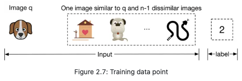

# Machine Learning System Design Interview

https://bytebytego.com/courses/machine-learning-system-design-interview/introduction-and-overview

# 01 Introduction & Overview

Components of a ML system for production.

## ML system design framework

### Clarifying Requirements

Ask questions to understand the exact requirements:

- **Business objective**. If we are asked to create a system to recommend vacation rentals, two possible motivations are to increase the number of bookings and increase the revenue.
- **Features the system needs to support**. What are some of the features that the system is expected to support which could affect our ML system design? For example, let’s assume we’re asked to design a video recommendation system. We might want to know if users can “like” or “dislike” recommended videos, as those interactions could be used to label training data.
- **Data**. What are the data sources? How large is the dataset? Is the data labeled?
- **Constraints**. How much computing power is available? Is it a cloud-based system, or should the system work on a device? Is the model expected to improve automatically over time?
- **Scale of the system**. How many users do we have? How many items, such as videos, are we dealing with? What’s the rate of growth of these metrics?
- **Performance**. How fast must prediction be? Is a real-time solution expected? Does accuracy have more priority or latency?

It’s generally a good idea to write down the list of requirements and constraints we gather. By doing so, we ensure everyone is on the same page.

### Frame the Problem as an ML Task

Convert a problem to a real ML task

- Defining the ML objective
- Specifying the system’s input and output
- Choosing the right ML category

##### Defining the ML objective

Translate the business objective into a well-defined ML objective.

| Application                                          | Business objective                                  | ML objective                                     |
| :--------------------------------------------------- | :-------------------------------------------------- | :----------------------------------------------- |
| Event ticket selling app                             | Increase ticket sales                               | Maximize the number of event registrations       |
| Video streaming app                                  | Increase user engagement                            | Maximize the time users spend watching videos    |
| Ad click prediction system                           | Increase user clicks                                | Maximize click-through rate                      |
| Harmful content detection in a social media platform | Improve the platform's safety                       | Accurately predict if a given content is harmful |
| Friend recommendation system                         | Increase the rate at which users grow their network | Maximize the number of formed connections        |

##### Specifying the system’s input and output

In some cases, the system may consist of more than one ML model. If so, we need to specify the input and output of each ML model. There might also be multiple ways to specify each model’s input-output.

##### Choosing the right ML category

Supervised / Unsupervised

Classification / Regression

##### Talking points

- What is a good ML objective? How do different ML objectives compare? What are the pros and cons?
- What are the inputs and outputs of the system, given the ML objective?
- If more than one model is involved in the ML system, what are the inputs and outputs of each model?
- Does the task need to be learned in a supervised or unsupervised way?
- Is it better to solve the problem using a regression or classification model? In the case of classification, is it binary or multiclass? In the case of regression, what is the output range?

### Data Preparation

##### Data Engineering

- Data source?
- New data coming in?
- Data storage?

- Data schema?

  - Structured

  - Unstructured

##### Feature Engineering

- Handling missing values
  - Deletion - Reduce data quantity
  - Imputation: Filling in missing values with their defaults, mean, median, or mode - Introduce noise
- Feature scaling
  - Normalization: $z=\frac{x-x_{min}}{x_{max}-x_{min}}$ - values are scaled into [0, 1]
  - Standardization: $z=\frac{x-\mu}{\sigma}$ - normal distribution

- Discretization

- Encoding categorical features
  - Integer encoding
  - One-hot encoding

##### Talking points

- **Data availability and data collection:** What are the data sources? What data is available to us, and how do we collect it? How large is the data size? How often do new data come in?
- **Data storage:** Where is the data currently stored? Is it on the cloud or on user devices? Which data format is appropriate for storing the data? How do we store multimodal data, e.g., a data point that might contain both images and texts?
- **Feature engineering:** How do we process raw data into a form that’s useful for the models? What should we do about missing data? Is feature engineering required for this task? Which operations do we use to transform the raw data into a format usable by the ML model? Do we need to normalize the features? Which features should we construct from the raw data? How do we plan to combine data of different types, such as texts, numbers, and images?
- **Privacy:** How sensitive are the available data? Are users concerned about the privacy of their data? Is anonymization of user data necessary? Is it possible to store users’ data on our servers, or is it only possible to access their data on their devices?
- **Biases:** Are there any biases in the data? If yes, what kinds of biases are present, and how do we correct them?

### Model Development

##### Model Selection

In practice, a typical process for selecting a model is to:

- **Establish a simple baseline.** For example, in a video recommendation system, the baseline can be obtained by recommending the most popular videos.
- **Experiment with simple models.** After we have a baseline, a good practice is to explore ML algorithms that are quick to train, such as logistic regression.
- **Switch to more complex models.** If simple models cannot deliver satisfactory results, we can then consider more complex models, such as deep neural networks.
- **Use an ensemble of models if we want more accurate predictions.** Using an ensemble of multiple models instead of only one may improve the quality of predictions. Creating an ensemble can be accomplished in three ways: bagging [3], boosting [4], and stacking [5], which will be discussed in later chapters.

Some typical model options include:

- Logistic regression
- Linear regression
- Decision trees
- Gradient boosted decision trees and random forests
- Support vector machines
- Naive Bayes
- Factorization Machines (FM)
- Neural networks

When choosing an ML algorithm, it’s important to consider different aspects of a model. For example:

- The amount of data the model needs to train on
- Training speed
- Hyperparameters to choose and hyperparameter tuning techniques
- Possibility of continuous learning
- Compute requirements. A more complex model might deliver higher accuracy, but might require more computing power, such as a GPU instead of a CPU
- Model’s interpretability [6]. A more complex model can give better performance, but its results may be less interpretable

##### Model Training

- Constructing dataset

  

  - Address any class imbalances
    - Upsampling or downsampling
    - Adjust weight in loss

- Choosing loss function

- Training from scratch or fine-tuning

- Distributed training

##### Talking points

- Model selection: Which ML models are suitable for the task, and what are their pros and cons. Here’s a list of topics to consider during model selection:
  - The time it takes to train
  - The amount of training data the model expects
  - The computing resources the model may need
  - Latency of the model at inference time
  - Can the model be deployed on a user’s device?
  - Model’s interpretability. Making a model more complex may increase its performance, but the results might be harder to interpret
  - Can we leverage continual training, or should we train from scratch?
  - How many parameters does the model have? How much memory is needed?
  - For neural networks, you might want to discuss typical architectures/blocks, such as ResNet or Transformer-based architectures. You can also discuss the choice of hyperparameters, such as the number of hidden layers, the number of neurons, activation functions, etc.
- Dataset labels: How should we obtain the labels? Is the data annotated, and if so, how good are the annotations? If natural labels are available, how do we get them? How do we receive user feedback on the system? How long does it take to get natural labels?
- Model training.
  - What loss function should we choose? (e.g., Cross-entropy [15], MSE [16], MAE [17], Huber loss [18], etc.)
  - What regularization should we use? (e.g., L1 [19], L2 [19], Entropy Regularization [20], K-fold CV [21], or dropout [22])
  - What is backpropagation?
  - You may need to describe common optimization methods [23] such as SGD [24], AdaGrad [25], Momentum [26], and RMSProp [27].
  - What activation functions do we want to use and why? (e.g., ELU [28], ReLU [29], Tanh [30], Sigmoid [31]).
  - How to handle an imbalanced dataset?
  - What is the bias/variance trade-off?
  - What are the possible causes of overfitting and underfitting? How to address them?

### Evaluation

##### Offline

| Task                        | Offline metrics                                              |
| :-------------------------- | :----------------------------------------------------------- |
| Classification              | Precision, recall, F1 score, accuracy, ROC-AUC, PR-AUC, confusion matrix |
| Regression                  | MSE, MAE, RMSE                                               |
| Ranking                     | Precision@k, recall@k, MRR, mAP, nDCG                        |
| Image generation            | FID [32], Inception score [33]                               |
| Natural language processing | BLEU [34], METEOR [35], ROUGE [36], CIDEr [37], SPICE [38]   |

##### Online

- Connected with A/B testing

| Problem                   | Online metrics                                               |
| :------------------------ | :----------------------------------------------------------- |
| Ad click prediction       | Click-through rate, revenue lift, etc.                       |
| Harmful content detection | Prevalence, valid appeals, etc.                              |
| Video recommendation      | Click-through rate, total watch time, number of completed videos, etc. |
| Friend recommendation     | Number of requests sent per day, number of requests accepted per day, etc. |

##### Talking points

Here are some talking points for the evaluation step:

- **Online metrics:** Which metrics are important for measuring the effectiveness of the ML system online? How do these metrics relate to the business objective?
- **Offline metrics:** Which offline metrics are good at evaluating the model’s predictions during the development phase?
- **Fairness and bias:** Does the model have the potential for bias across different attributes such as age, gender, race, etc.? How would you fix this? What happens if someone with malicious intent gets access to your system?

### Deployment

|                                   | **Cloud**                                                    | **On-device**                                                |
| --------------------------------- | ------------------------------------------------------------ | ------------------------------------------------------------ |
| Simplicity                        | ✓ Simple to deploy and manage using cloud-based services     | ✘ Deploying models on a device is not straightforward        |
| Cost                              | ✘ Cloud costs might be high                                  | ✓ No cloud cost when computations are performed on-device    |
| Network latency                   | ✘ Network latency is present                                 | ✓ No network latency                                         |
| Inference latency                 | ✓ Usually faster inference due to more powerful machines     | ✘ ML models run slower                                       |
| Hardware constraints              | ✓ Fewer constraints                                          | ✘ More constraints, such as limited memory, battery consumption, etc. |
| Privacy                           | ✘ Less privacy as user data is transferred to the cloud      | ✓ More privacy since data never leaves the device            |
| Dependency on internet connection | ✘ Internet connection needed to send and receive data to the cloud | ✓ No internet connection needed                              |

##### Shadow Deployment

In this method, we deploy the new model in parallel with the existing model. Each incoming request is routed to both models, but only the existing model's prediction is served to the user.

By shadow deploying the model, we minimize the risk of unreliable predictions until the newly developed model has been thoroughly tested. However, this is a costly approach that doubles the number of predictions.

##### A/B

With this method, we deploy the new model in parallel with the existing model. A portion of the traffic is routed to the newly developed model, while the remaining requests are routed to the existing model.

In order to execute A/B testing correctly, there are two important factors to consider. First, the traffic routed to each model has to be random. Second, A/B tests should be run on a sufficient number of data points in order for the results to be legitimate.

##### Prediction Pipeline

- **Batch prediction.** With batch prediction, the model makes predictions periodically. Because predictions are pre-computed, we don’t need to worry about how long it takes the model to generate predictions once they are pre-computed.

However, the batch prediction has two major drawbacks. First, the model becomes less responsive to the changing preferences of users. Secondly, batch prediction is only possible if we know in advance what needs to be pre-computed. For example, in a language translation system, we are not able to make translations in advance as it entirely depends on the user’s input.

- **Online prediction.** In online prediction, predictions are generated and returned as soon as requests arrive. The main problem with online prediction is that the model might take too long to generate predictions.

This choice of batch prediction or online prediction is mainly driven by product requirements. Online prediction is generally preferred in situations where we do not know what needs to be computed in advance. Batch prediction is ideal when the system processes a high volume of data, and the results are not needed in real time.

##### Talking points

- Is model compression needed? What are some commonly used compression techniques?
- Is online prediction or batch prediction more suitable? What are the trade-offs?
- Is real-time access to features possible? What are the challenges?
- How should we test the deployed model in production?
- An ML system consists of various components working together to serve requests. What are the responsibilities of each component in the proposed design?
- What technologies should we use to ensure that serving is fast and scalable?

## Summary

In this chapter, we proposed a framework for an ML system design interview. While many topics discussed in this chapter are task-specific, some are generic and applicable to a wide range of tasks. Throughout this book, we only focus on unique talking points specific to the problem at hand, in order to avoid repetition. For example, topics related to deployment, monitoring, and infrastructure are often similar, regardless of the task. Therefore, we do not repeat generic topics in later chapters, but you are usually expected to talk about them during an interview.

Finally, no engineer can be an expert in every aspect of the ML lifecycle. Some engineers specialize in deployment and production, while others specialize in model development. Some companies may not care about infrastructure, while others may focus heavily on monitoring and infrastructure. Data science roles generally require more data engineering, while applied ML roles focus more on model development and productionization. Depending on the role and the interviewer's preference, some steps may be discussed in more detail, while others may be discussed briefly or even skipped. In general, a candidate should seek to drive the conversation, while being ready to go with the interviewer’s flow, if they raise a question.

Now you understand these fundamentals, we’re ready to tackle some of the most common ML system design interview questions.

## References

1. Data warehouse. https://cloud.google.com/learn/what-is-a-data-warehouse.
2. Structured vs. unstructured data. https://signal.onepointltd.com/post/102gjab/machine-learning-libraries-for-tabular-data-problems.
3. Bagging technique in ensemble learning. https://en.wikipedia.org/wiki/Bootstrap_aggregating.
4. Boosting technique in ensemble learning. https://aws.amazon.com/what-is/boosting/.
5. Stacking technique in ensemble learning. https://machinelearningmastery.com/stacking-ensemble-machine-learning-with-python/.
6. Interpretability in Machine Mearning. https://blog.ml.cmu.edu/2020/08/31/6-interpretability/.
7. Traditional machine learning algorithms. https://machinelearningmastery.com/a-tour-of-machine-learning-algorithms/.
8. Sampling strategies. https://www.scribbr.com/methodology/sampling-methods/.
9. Data splitting techniques. https://machinelearningmastery.com/train-test-split-for-evaluating-machine-learning-algorithms/.
10. Class-balanced loss. https://arxiv.org/pdf/1901.05555.pdf.
11. Focal loss paper. https://arxiv.org/pdf/1708.02002.pdf.
12. Focal loss. https://medium.com/swlh/focal-loss-an-efficient-way-of-handling-class-imbalance-4855ae1db4cb.
13. Data parallelism. https://www.telesens.co/2017/12/25/understanding-data-parallelism-in-machine-learning/.
14. Model parallelism. https://docs.aws.amazon.com/sagemaker/latest/dg/model-parallel-intro.html.
15. Cross entropy loss. https://en.wikipedia.org/wiki/Cross_entropy.
16. Mean squared error loss. https://en.wikipedia.org/wiki/Mean_squared_error.
17. Mean absolute error loss. https://en.wikipedia.org/wiki/Mean_absolute_error.
18. Huber loss. https://en.wikipedia.org/wiki/Huber_loss.
19. L1 and l2 regularization. https://www.analyticssteps.com/blogs/l2-and-l1-regularization-machine-learning.
20. Entropy regularization. https://paperswithcode.com/method/entropy-regularization.
21. K-fold cross validation. https://en.wikipedia.org/wiki/Cross-validation_(statistics).
22. Dropout paper. https://jmlr.org/papers/volume15/srivastava14a/srivastava14a.pdf.
23. Overview of optimization algorithm. https://ruder.io/optimizing-gradient-descent/.
24. Stochastic gradient descent. https://en.wikipedia.org/wiki/Stochastic_gradient_descent.
25. AdaGrad optimization algorithm. https://optimization.cbe.cornell.edu/index.php?title=AdaGrad.
26. Momentum optimization algorithm. https://optimization.cbe.cornell.edu/index.php?title=Momentum.
27. RMSProp optimization algorithm. https://optimization.cbe.cornell.edu/index.php?title=RMSProp.
28. ELU activation function. https://ml-cheatsheet.readthedocs.io/en/latest/activation_functions.html#elu.
29. ReLU activation function. https://ml-cheatsheet.readthedocs.io/en/latest/activation_functions.html#relu.
30. Tanh activation function. https://ml-cheatsheet.readthedocs.io/en/latest/activation_functions.html#tanh.
31. Sigmoid activation function. https://ml-cheatsheet.readthedocs.io/en/latest/activation_functions.html#softmax.
32. FID score. [https://en.wikipedia.org/wiki/Fr%C3%A9chet_inception_distance](https://en.wikipedia.org/wiki/Fréchet_inception_distance).
33. Inception score. https://en.wikipedia.org/wiki/Inception_score.
34. BLEU metrics. https://en.wikipedia.org/wiki/BLEU.
35. METEOR metrics. https://en.wikipedia.org/wiki/METEOR.
36. ROUGE score. https://en.wikipedia.org/wiki/ROUGE_(metric).
37. CIDEr score. https://arxiv.org/pdf/1411.5726.pdf.
38. SPICE score. https://arxiv.org/pdf/1607.08822.pdf.
39. Quantization-aware training. https://pytorch.org/docs/stable/quantization.html.
40. Model compression survey. https://arxiv.org/pdf/1710.09282.pdf.
41. Shadow deployment. [https://christophergs.com/machine%20learning/2019/03/30/deploying-machine-learning-applications-in-shadow-mode/](https://christophergs.com/machine learning/2019/03/30/deploying-machine-learning-applications-in-shadow-mode/).
42. A/B testing. https://en.wikipedia.org/wiki/A/B_testing.
43. Canary release. https://blog.getambassador.io/cloud-native-patterns-canary-release-1cb8f82d371a.
44. Interleaving experiment. https://netflixtechblog.com/interleaving-in-online-experiments-at-netflix-a04ee392ec55.
45. Multi-armed bandit. https://vwo.com/blog/multi-armed-bandit-algorithm/.
46. ML infrastructure. https://www.run.ai/guides/machine-learning-engineering/machine-learning-infrastructure.
47. Interpretability in ML. https://fullstackdeeplearning.com/spring2021/lecture-6/.
48. Chip Huyen. *Designing Machine Learning Systems: An Iterative Process for Production-Ready Application*. ” O’Reilly Media, Inc.”, 2022.

# 02 Visual Search System

## Clarifying Requirements

**Candidate**: Should we rank the results from most similar to least similar?
**Interviewer**: Images that appear first in the list should be more similar to the query image.

**Candidate**: Should the system support videos, too?
**Interviewer**: Let’s focus only on images.

**Candidate**: A platform like Pinterest allows users to select an image crop and retrieve similar images. Should we support that functionality?
**Interviewer**: Yes.

**Candidate**: Are the displayed images personalized to the user?
**Interviewer**: For simplicity, let’s not focus on personalization. A query image yields the same results, regardless of who searches for it.

**Candidate**: Can the model use the metadata of the query image, such as image tags?
**Interviewer**: In practice, the model uses image metadata. But for simplicity, let’s assume we don’t rely on the metadata, but only on the image pixels.

**Candidate**: Can users perform other actions such as save, share, or like? These actions can help label training data.
**Interviewer**: Great point. For simplicity, let’s assume the only supported action is image clicks.

**Candidate**: Should we moderate the images?
**Interviewer**: It’s important to keep the platform safe, but content moderation is out of scope.

**Candidate**: We can construct training data online and label them based on user interactions. Is this the expected way to construct training data?
**Interviewer**: Yes, that sounds reasonable.

**Candidate**: How fast should the search be? Assuming we have 100-200 billion images on the platform, the system should be able to retrieve similar images quickly. Is that a reasonable assumption?
**Interviewer**: Yes, that is a reasonable assumption.

Sumamrize:

- Design a visual search system that retrieves images similar to the query image provided by the user
- Ranks them based on their similarities to the query image, and then displays them to the user
- Only supports images, with no video or text queries allowed. For simplicity, no personalization is required.

## Frame the Problem as an ML Task

### Defining the ML objective

Accurately retrieve images that are visually similar to the image the user is searching for.

### Specifying input & output

Input: query image from user

Output: similar images ranked by similarities

### Choosing the righe ML category

Ranking + Representation Learning

## Data Preparation

### Date engineering

##### Images

Creators upload images, and the system stores the images and their metadata, such as owner id, contextual information (e.g., upload time), tags, etc. Table 2.1 shows a simplified example of image metadata.

| ID   | Owner ID | Upload time | Manual tags             |
| :--- | :------- | :---------- | :---------------------- |
| 1    | 8        | 1658451341  | Zebra                   |
| 2    | 5        | 1658451841  | Pasta, Food, Kitchen    |
| 3    | 19       | 1658821820  | Children, Family, Party |

##### Users

User data contains demographic attributes associated with users, such as age, gender, etc. Table 2.2 shows an example of user data.

| **ID** | **Username** | **Age** | **Gender** | **City** | **Country** | **Email**                                 |
| ------ | ------------ | ------- | ---------- | -------- | ----------- | ----------------------------------------- |
| 1      | johnduo      | 26      | M          | San Jose | USA         | [john@gmail.com](mailto:john@gmail.com)   |
| 2      | hs2008       | 49      | M          | Paris    | France      | [hsieh@gmail.com](mailto:hsieh@gmail.com) |
| 3      | alexish      | 16      | F          | Rio      | Brazil      | [alexh@yahoo.com](mailto:alexh@yahoo.com) |

##### User-image interactions

Interaction data contains different types of user interactions. Based on the requirements gathered, the primary types of interactions are impressions and clicks. Table 2.3 shows an overview of interaction data.

| User ID | Query image ID | Displayed image ID | Position in the displayed list | Interaction type | Location (lat, long) | Timestamp  |
| :------ | :------------- | :----------------- | :----------------------------- | :--------------- | :------------------- | :--------- |
| 8       | 2              | 6                  | 1                              | Click            | 38.8951 -77.0364     | 1658450539 |
| 6       | 3              | 9                  | 2                              | Click            | 38.8951 -77.0364     | 1658451341 |
| 91      | 5              | 1                  | 2                              | Impression       | 41.9241 -89.0389     | 1658451365 |

### Feature Engineering

Common image preprocessing operations:

- **Resizing:** Models usually require fixed image sizes (e.g., 224×224)
- **Scaling:** Scale pixel values of the image to the range of 0 and 1
- **Z-score normalization:** Scale pixel values to have a mean of 0 and variance of 1
- **Consistent :** Ensuring images have a consistent color mode (e.g., RGB or CMYK)

## Model Development

### Model Selection

CNN-based or Transformer-based

### Model Training

A common technique for learning image representations is contrastive training.

#### Constructing Dataset

Each data sample: (query image, 1 similar image and n-1 dissimilar images, idx of the similar image)

Sources of the positive image:

- Human Annotation
- Data Augmentation: rotating / noise - less human work

==In an interview setting, it’s critical you propose various options and discuss their tradeoffs. Discussing different options and trade-offs with the interviewer is critical to make good design decisions.==

#### Choosing loss

Contrastive loss [9]

1. Compute similarities between embeddings of query image and other images.
2. Softmax
3. Cross-entropy

## Evaluation

### Offline metrics

==Search, information retrieval, and recommendation systems usually share the same offline metrics.==

- Mean reciprocal rank (MRR)
- Recall@k
- Precision@k
- Mean average precision (mAP)
- Normalized discounted cumulative gain (nDCG)

Testing data sample: 

#### MRR

$$
MRR=\frac{1}{m}\sum^m_{i=1}\frac{1}{rank_i}
$$

m is the total number of output lists and rank_i refers to the rank of the first relevant item in the *i*th output list.

This does not measure the ranking.

#### Recall@K

**The ratio between the number of relevant items in the output list and the total number of relevant items available in the entire dataset.** Can be negatively affected when the number of relevant items is very large.

Does not measure the ranking.

#### Precision@K

**The proportion of relevant items among the top k items in the output list.**

Does not measure the ranking.

#### mAP

Measures the ranking, but only works for binary relevances, i.e., when items is either relevant or irrelevant.

#### nDCG (Normalized discounted cumulative gain)

Measures the ranking quality of an output list and shows how good the ranking is, compared to the ideal ranking.

DCG: 
$$
DCG_p=\sum^p_{i=1}\frac{rel_i}{\log_2(i+1)}
$$
$rel_i$ is the ground truth relevance score of the image ranked at location i

nDCG = DCG / IDCG, IDCG is ideal DCG (DCG for ideal ranking)

### Online metrics

#### CTR (Click-through rate)

CTR = Number of clicked images / Total number of suggested images

## Serving

Embedding generation service: generate embeddings for input query image

Nearest neighbor service: find similair images from from embedding space.

## Other Talking Points

- Moderate content in the system by identifying and blocking inappropriate images [24].
- Different biases present in the system, such as positional bias [25][26].
- How to use image metadata such as tags to improve search results. This is covered in Chapter 3 Google Street View Blurring System.
- Smart crop using object detection [27].
- How to use graph neural networks to learn better representations [28].
- Support the ability to search images by a textual query. We examine this in Chapter 4.
- How to use active learning [29] or human-in-the-loop [30] ML to annotate data more efficiently.

 # 03 Google Street View Blurring System

## Clarification

**Candidate:** Is it fair to say the business objective of the system is to protect user privacy?
**Interviewer:** Yes.

**Candidate:** We want to design a system that detects all human faces and license plates in Street View images and blurs them before displaying them to users. Is that correct? Can I assume users can report images that are not correctly blurred?
**Interviewer:** Yes, those are fair assumptions.

**Candidate:** Do we have an annotated dataset for this task?
**Interviewer:** Let's assume we have sampled 1 million images. Human faces and license plates are manually annotated in those images.

**Candidate:** The dataset may not contain faces from certain racial profiles, which may cause a bias towards certain human attributes such as race, age, gender, etc. Is that a fair assumption?
**Interviewer:** Great point. For simplicity, let's not focus on fairness and bias today.

**Candidate:** My understanding is that latency is not a big concern, as the system can detect objects and blur them offline. Is that correct?
**Interviewer:** Yes. We can display existing images to users while new ones are being processed offline.

Let's summarize the problem statement. We want to design a Street View blurring system that automatically blurs license plates and human faces. We are given a training dataset of 1 million images with annotated human faces and license plates. The business objective of the system is to protect user privacy.

## Frame the Problem as an ML Task

### Defining the ML objective

One possible ML objective is to accurately detect objects of interest in an image. If an ML system can detect those objects accurately, then we can blur the objects before displaying the images to users.

### Specifying input and output

The input of an object detection model is an image with zero or multiple objects at different locations within it. The model detects those objects and outputs their locations.

### Choosing the right ML category

Two-stage solution:

1. **Region proposal network:** scans an image and proposes candidate regions that are likely to be objects.
2. **Classifier:** processes each proposed region and classifies it into an object class.

## Data Preparation

### Data engineering

we have the following data available:

- Annotated dataset

  | **Image path**     | **Objects**                         | **Bounding boxes**                          |
  | ------------------ | ----------------------------------- | ------------------------------------------- |
  | dataset/image1.jpg | human face human face license plate | [10,10,25,50] [120,180,40,70] [80,95,35,10] |
  | dataset/image2.jpg | human face                          | [170,190,30,80]                             |
  | dataset/image3.jpg | license plate human face            | [25,30,210,220] [30,40,30,60]               |

- Street View images

### Feature engineering

1. Apply standard methods, such as resizing and normalization

2. Data augmentation

- Random crop
- Random saturation
- Vertical or horizontal flip
- Rotation
- Changing brightness, saturation, or contrast

​	Remember to change the ground truth bounding boxes along with the pictures.

**Online vs. offline:** In offline data augmentation, training is faster since no additional augmentation is needed. However, it requires additional storage to store all the augmented images. While online data augmentation slows down training, it does not consume additional storage.

The choice between online and offline data augmentation depends upon the storage and computing power constraints. ==What is more important in an interview is that you talk about different options and discuss trade-offs==

## 

## Model Development

### Model Selection

For both RPN and Classifier, we go with NN.

### Model Training

For RPN, we use regression loss, such as Mean Squared Error.

For Classifier, we use cross-entropy.

## Evaluation

An object detection model usually needs to detect N different objects in an image. To measure the overall performance of the model, we evaluate each object separately and then average the results.

**Intersection Over Union (IOU):** IOU measures the overlap between two bounding boxes. Figure 3.93.9 shows a visual representation of IOU.

IOU determines whether a detected bounding box is correct. An IOU of 1 is ideal, indicating the detected bounding box and the ground truth bounding box are fully aligned. In practice, it's rare to see an IOU of 1 . A higher IOU means the predicted bounding box is more accurate. An IOU threshold is usually used to determine whether a detected bounding box is correct (true positive) or incorrect (false positive). For example, an IOU threshold of 0.7 means any detection that has an overlap of 0.7 or higher with a ground truth bounding box, is a correct detection.

### Offline Metrics

- Precision
- Average precision: average of precision along all the choices of IOU threshold
- Mean average precision: average of AP along all the classes of objects

### Online Metrics

- User reports and complaints.

## Serving

**NMS** (Non-maximum suppression) is a post-processing algorithm designed to select the most appropriate bounding boxes. It keeps highly confident bounding boxes and removes overlapping bounding boxes. 

##### Batch prediction pipeline

Based on the requirements gathered, latency is not a big concern because we can display existing images to users while new ones are being processed. Since instant results are not required, we can utilize batch prediction and precompute the object detection results.

**Preprocessing** Raw images are preprocessed by this component. This section does not discuss the preprocess operations as we have already discussed them in the feature engineering section.

**Blurring service** This performs the following operations on a Street View image:

1. Provides a list of objects detected in the image.
2. Refines the list of detected objects using the NMS component.
3. Blurs detected objects.
4. Stores the blurred image in object storage (Blurred Street View images).

Note that the preprocessing and blurring services are separate in the design. The reason is preprocessing images tends to be a CPU-bound process, whereas blurring service relies on GPU. Separating these services has two benefits:

- Scale the services independently based on the workload each receives.
- Better utilization of CPU and GPU resources.

##### Data pipeline

This pipeline is responsible for processing users' reports, generating new training data, and preparing training data to be used by the model. Data pipeline components are mostly self-explanatory. Hard negative mining is the only component that needs more explanation.

# 04 Youtube Video Search

## Clarifying Requirements

**Candidate:** Is the input query text-only, or can users search with an image or video?
**Interviewer:** Text queries only.

**Candidate:** Is the content on the platform only in video form? How about images or audio files?
**Interviewer:** The platform only serves videos.

**Candidate:** The YouTube search system is very complex. Can I assume the relevancy of a video is determined solely by its visual content and the textual data associated with the video, such as the title and description?
**Interviewer:** Yes, that's a fair assumption.

**Candidate:** Is there any training data available?
**Interviewer:** Yes, let's assume we have ten million pairs of ⟨⟨ video, text query ⟩⟩.

**Candidate:** Do we need to support other languages in the search system?
**Interviewer:** For simplicity, let's assume only English is supported.

**Candidate:** How many videos are available on the platform?
**Interviewer:** One billion videos.

**Candidate:** Do we need to personalize the results? Should we rank the results differently for different users, based on their past interactions?
**Interviewer:** As opposed to recommendation systems where personalization is essential, we do not necessarily have to personalize results in search systems. To simplify the problem, let's assume no personalization is required.

## Frame the Problem as an ML Task

### Defining ML objective

One way to translate this into an ML objective is to rank videos based on their relevance to the text query.

### Specifying input and output

Takes a text query as input and outputs a ranked list of videos sorted by their relevance to the text query.

### Choosing the right ML category

Visual Search: Get embeddings for videos and text queries, and compute the similarity score by dot product. Then we rank the videos based on their similarity scores.

Test search: Commonly uses "inverted index" to search video titles and descriptions. **No need to use ML models.** (Can also discuss trade-off here)

## Data Preparation

### Data engineering

Training data ready: <video, query>

### Feature engineering

Preprocess video: decode frames, sample frames, resizing, and normalizing

## Model Development

### Model Selection

Text encoder: Bert/LLM

Video encoder

- video model: slower but better performative
- frame model: faster, computational efficient but less performative

### Model Development

## Evaluation

- MRR (Mean Reciprocal Rank)
  $$
  MRR=\frac{1}{m}\sum^m_{i=1} \frac{1}{rank_i}
  $$
  
- Online metrics
  - **CTR**
  - **Video completion rate**
  - **Total watch time of search results.**

## Serving

**Fusing layer.** This component takes two different lists of relevant videos from the previous step, and combines them into a new list of videos.

The fusing layer can be implemented in two ways, the easiest of which is to re-rank videos based on the weighted sum of their predicted relevance scores. A more complex approach is to adopt an additional model to re-rank the videos, which is more expensive because it requires model training. Additionally, it's slower at serving. As a result, we use the former approach.

## Other talking points

Before concluding this chapter, it's important to note we have simplified the system design of the video search system. In practice, it is much more complex. Some improvements may include:

- Use a multi-stage design (candidate generation + ranking).
- Use more video features such as video length, video popularity, etc.
- Instead of relying on annotated data, use interactions (e.g., clicks, likes, etc.) to construct and label data. This allows us to continuously train the model.
- Use an ML model to find titles and tags which are semantically similar to the text query. This model can be combined with Elasticsearch to improve search quality.

If there's time left at the end of the interview, here are some additional talking points:

- An important topic in search systems is query understanding, such as spelling correction, query category identification, and entity recognition. How to build a query understanding component? 
- How to build a multi-modal system that processes speech and audio to improve search results.
- How to extend this work to support other languages.
- Near-duplicate videos in the final output may negatively impact user experience. How to detect near-duplicate videos so we can remove them before displaying the results.
- Text queries can be divided into head, torso, and tail queries. What are the different approaches commonly used in each case.
- How to consider popularity and freshness when producing the output list.

# 06 Video Recommendation System

## Clarification

**Candidate:** Can I assume the business objective of building a video recommendation system is to increase user engagement?
**Interview**: That’s correct.

**Candidate:** Does the system recommend similar videos to a video a user is watching right now? Or does it show a personalized list of videos on the user’s homepage?
**Interviewer:** This is a homepage video recommendation system, which recommends personalized videos to users when they load the homepage.

**Candidate:** Since YouTube is a global service, can I assume users are located worldwide and videos are in different languages?
**Interviewer:** That’s a fair assumption.

**Candidate:** Can I assume we can construct the dataset based on user interactions with video content?
**Interviewer:** Yes, that sounds good.

**Candidate:** Can a user group videos together by creating playlists? Playlists can be informative for the ML model during the learning phase.
**Interviewer:** For the sake of simplicity, let’s assume the playlist feature does not exist.

**Candidate:** How many videos are available on the platform?
**Interviewer:** We have about 10 billion videos.

**Candidate:** How fast should the system recommend videos to a user? Can I assume the recommendation should not take more than 200 milliseconds?
**Interviewer:** That sounds good.

## Frame the Problem as an ML Task

### Defining the ML objective

**Maximize the number of relevant videos.** This objective produces recommendations that are relevant to users. Engineers or product managers can define relevance based on some rules. Such rules can be based on implicit and explicit user reactions. For example, one definition could state a video is relevant if a user explicitly presses the "like" button or watches at least half of it. Once we define relevance, we can construct a dataset and train a model to predict the relevance score between a user and a video.

### Specifying input and output

- Input: user/user profile
- Output: Ranked list of videos

### Chossing the right ML category

#### Content-based filtering

1. User A engaged with videos XX and YY in the past
2. Video ZZ is similar to video XX and video YY
3. The system recommends video ZZ to user AA

Content-based filtering has pros and cons.

**Pros:**

- **Ability to recommend new videos.** With this method, we don't need to wait for interaction data from users to build video profiles for new videos. The video profile depends entirely upon its features.
- **Ability to capture the unique interests of users.** This is because we recommend videos based on users' previous engagements.

**Cons:**

- **Difficult to discover a user's new interests.**
- The method requires **domain knowledge**. We often need to engineer video features manually.

#### Collaborative filtering (CF)

The goal is to recommend a new video to user A.

1. Find a similar user to AA based on their previous interactions; say user BB
2. Find a video that user B engaged with but which user A has not seen yet; say video ZZ
3. Recommend video ZZ to user AA

**Pros:**

- **No domain knowledge needed.** CF does not rely on video features, which means no domain knowledge is needed to engineer features from videos.
- **Easy to discover users' new areas of interest.** The system can recommend videos about new topics that other similar users engaged with in the past.
- **Efficient.** Models based on CF are usually faster and less compute-intensive than content-based filtering, as they do not rely on video features.

**Cons:**

- **Cold-start problem.** This refers to a situation when limited data is available for a new video or user, meaning the system cannot make accurate recommendations. CF suffers from a cold-start problem due to the lack of historical interaction data for new users or videos. This lack of interactions prevents CF from finding similar users or videos. We will discuss later in the serving section how our system handles the cold-start problem.
- **Cannot handle niche interests.** It's difficult for CF to handle users with specialized or niche interests. CF relies upon similar users to make recommendations, and it might be difficult to find similar users with niche interests.

#### Hybrid Filtering (Sequential)

Input -> CF Based filtering -> Content based filtering -> Output

## Data Preparation

### Data engineering

VIdeos

| **Video ID** | **Length** | **Manual tags** | **Manual title**            | **Likes** | **Views** | **Language** |
| :----------- | :--------- | :-------------- | :-------------------------- | :-------- | :-------- | :----------- |
| 1            | 28         | Dog, Family     | Our lovely dog playing!     | 138       | 5300      | English      |
| 2            | 300        | Car, Oil        | How to change your car oil? | 5         | 250       | Spanish      |
| 3            | 3600       | Ouli, Vlog      | Ooneymoon to Bali           | 2200      | 255K      | Arabic       |

User

| **ID** | **Username** | **Age** | **Gender** | **City** | **Country** | **Language** |
| :----- | :----------- | :------ | :--------- | :------- | :---------- | :----------- |
|        |              |         |            |          |             |              |

User-video interactions

| **User ID** | **Video ID** | **Interaction type** | **Interaction value** | **Location (lat, long)** | **Timestamp** |
| :---------- | :----------- | :------------------- | :-------------------- | :----------------------- | :------------ |
| 4           | 18           | Like                 | -                     | 38.8951 -77.0364         | 1658451361    |
| 2           | 18           | Impression           | 8 seconds             | 38.8951 -77.0364         | 1658451841    |
| 2           | 6            | Watch                | 46 minutes            | 41.9241 -89.0389         | 1658822820    |
| 6           | 9            | Click                | -                     | 22.7531 47.9642          | 1658832118    |
| 9           | -            | Search               | Basics of clustering  | 22.7531 47.9642          | 1659259402    |
| 8           | 6            | Comment              | Amazing video. Thanks | 37.5189 122.6405         | 1659244197    |

### Feature engineering

Discrete tags/numeric features: keep the number

Text features: embedding

Liked videos/Impressions/Watched videos: vision emebdding

 
