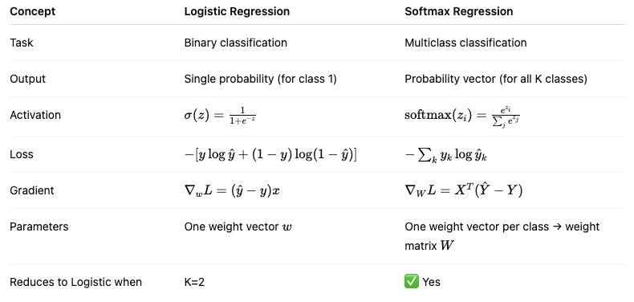

# Logistic Regression

## Theory

### Math

Sigmoid activation
$$
h(x)=\frac{1}{1+e^{-z}}=\frac{1}{1+e^{-wX+b}}
$$
The goal is to find weights w and bias b that **maximize** the likelihood of observing the data.

Probability
$$
p(y|x;\theta)=h_\theta(x)^y(1-h_\theta(x))^{(1-y)}
$$
Likelihood of Parameters
$$
L(\theta)=\Pi^m_{i=1}h_\theta(x^{(i)})^{y^{(i)}}(1-h_\theta(x)^{(i)})^{(1-y^{(i)})}
$$
Log likelihood
$$
l(\theta)=\sum^m_{i=1}y^{(i)}\log h_\theta(x^{(i)})+(1-y^{(i)})\log (1-h_\theta(x^{(i)}))
$$
### Gradient

To find the best w and b we use **gradient ascent** on the **log-likelihood function** - the $l(\theta)$
$$
l'_{w_j}=\frac{1}{n}\sum_{i=1}^n(y_i-h_\theta(x))x_{ij}
$$

$$
\theta_j=\theta_j+\alpha l'_{w_j}\\=\theta_j+\alpha\frac{1}{n}\sum^n_{i=1}x^{(i)}(y^{(i)}-h_\theta(x^{(i)}))
$$

### Loss

That gives the loss to minimize - **negative log-likelihood**

## Pseudo Code

```python
def LogisticRegression(features, labels, weights, lr, epoch):
    for i in epoch:
        weights = updateWeights(features, labels, weights, lr)
    return weights

def sigmoid(x):
    return 1 / (1 + exp(-x))

def h(features, weights):
    return sigmoid(np.dot(features, weights))

def updateWeights(features, labels, weights, lr):
    # features: [x, f]
    # labels: [x]
    # weights: [f]
    predictions = h(features, weights)  # [x, f] * [f] -> [x]
    gradient = np.dot(features.T, labels-predictions)  # [f, x] * [x] -> [f]
    gradient /= labels.size
    weights += lr * gradient
    return weights
```

## Coding

```python
import numpy as np

class LogisticRegression:
    def __init__(self, lr=0.01, n_iter=1000):
        self.lr = lr
        self.n_iter = n_iter
        self.weights = None
        self.bias = None

    def sigmoid(self, z):
        return 1 / (1 + np.exp(-z))
    
    def fit(self, X, y):
        n_samples, n_features = X.shape
        # initialize parameters
        self.weights = np.zeros(n_features)
        self.bias = 0

        for _ in range(self.n_iter):
            # linear model
            linear_model = np.dot(X, self.weights) + self.bias
            # prediction
            y_predicted = self.sigmoid(linear_model)

            # gradients
            dw = (1 / n_samples) * np.dot(X.T, (y_predicted - y))
            db = (1 / n_samples) * np.sum(y_predicted - y)

            # update
            self.weights -= self.lr * dw
            self.bias -= self.lr * db

    def predict_proba(self, X):
        linear_model = np.dot(X, self.weights) + self.bias
        return self.sigmoid(linear_model)

    def predict(self, X, threshold=0.5):
        return np.where(self.predict_proba(X) >= threshold, 1, 0)
```

# Softmax Regression

### **Setup**

- Input $x \in \mathbb{R}^d$
- Labels $y \in \{1, 2, ..., K\}$
- Weight matrix $W \in \mathbb{R}^{d \times K}, b \in \mathbb{R}^K$

### **Prediction**

For each class k

$P(y = k | x) = \frac{e^{w_k^T x + b_k}}{\sum_{j=1}^{K} e^{w_j^T x + b_j}}$

Let’s denote $\hat{y} = \text{softmax}(W^T x + b)$

------

### Loss Function (Categorical Cross-Entropy)

If we use one-hot encoded labels

$L = - \frac{1}{N} \sum_{i=1}^{N} \sum_{k=1}^{K} y_{ik} \log \hat{y}_{ik}$

------

### **Gradient**

For weights:

$\nabla_W L = \frac{1}{N} X^T (\hat{Y} - Y)$

For bias:

$\nabla_b L = \frac{1}{N} \sum_{i=1}^{N} (\hat{y}_i - y_i)$



```python
import numpy as np

# ----- Step 1: Generate toy dataset -----
np.random.seed(42)
num_samples = 300
num_features = 4
num_classes = 3

X = np.random.randn(num_samples, num_features)
true_W = np.random.randn(num_features, num_classes)
true_b = np.random.randn(num_classes)
y = np.argmax(X @ true_W + true_b + np.random.randn(num_samples, num_classes)*0.5, axis=1)

# ----- Step 2: One-hot encode labels -----
def one_hot(y, num_classes):
    y_onehot = np.zeros((len(y), num_classes))
    y_onehot[np.arange(len(y)), y] = 1
    return y_onehot

y_onehot = one_hot(y, num_classes)

# ----- Step 3: Initialize weights -----
W = np.zeros((num_features, num_classes))
b = np.zeros((num_classes,))

# ----- Step 4: Define helper functions -----
def softmax(z):
    exp_z = np.exp(z - np.max(z, axis=1, keepdims=True))  # for numerical stability
    return exp_z / np.sum(exp_z, axis=1, keepdims=True)

def cross_entropy_loss(y_true, y_pred):
    return -np.mean(np.sum(y_true * np.log(y_pred + 1e-8), axis=1))

# ----- Step 5: Gradient Descent -----
lr = 0.1
epochs = 500

for epoch in range(epochs):
    # Forward pass
    logits = X @ W + b
    y_pred = softmax(logits)
    loss = cross_entropy_loss(y_onehot, y_pred)

    # Gradients
    grad_W = (1 / num_samples) * X.T @ (y_pred - y_onehot)
    grad_b = (1 / num_samples) * np.sum(y_pred - y_onehot, axis=0)

    # Parameter update
    W -= lr * grad_W
    b -= lr * grad_b

    if (epoch + 1) % 50 == 0:
        print(f"Epoch {epoch+1}: Loss = {loss:.4f}")

# ----- Step 6: Evaluate -----
pred_labels = np.argmax(X @ W + b, axis=1)
acc = np.mean(pred_labels == y)
print(f"\nTraining Accuracy: {acc*100:.2f}%")

```

